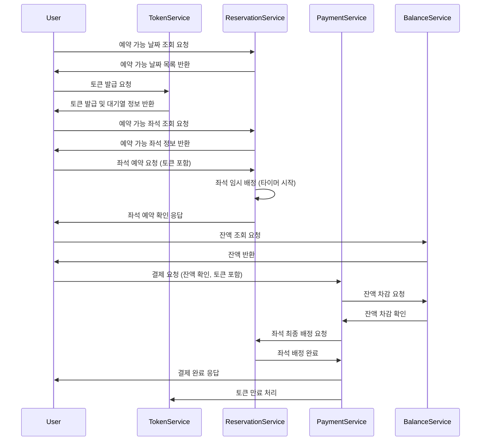
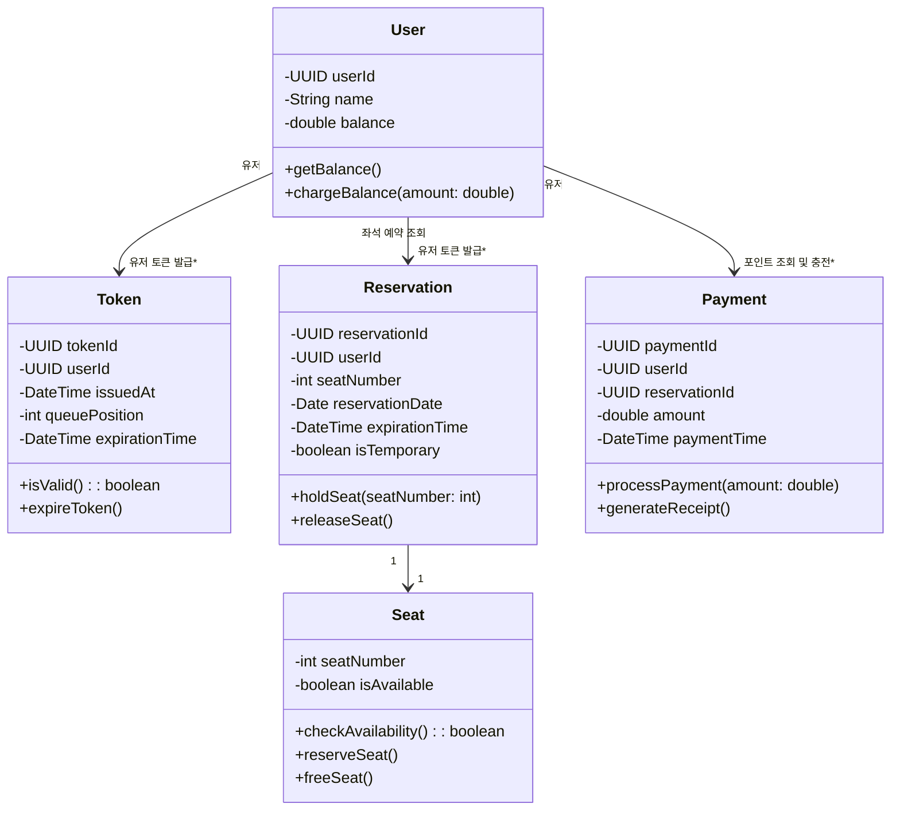
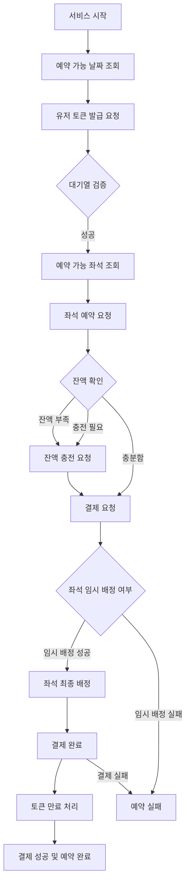

### 시퀀스 다이어그램

```mermaid
sequenceDiagram
    participant User
    participant TokenService
    participant ReservationService
    participant PaymentService
    participant BalanceService

    User ->> ReservationService: 예약 가능 날짜 조회 요청
    ReservationService ->> User: 예약 가능 날짜 목록 반환
    
    User ->> TokenService: 토큰 발급 요청
    TokenService ->> User: 토큰 발급 및 대기열 정보 반환

    User ->> ReservationService: 예약 가능 좌석 조회 요청
    ReservationService ->> User: 예약 가능 좌석 정보 반환

    User ->> ReservationService: 좌석 예약 요청 (토큰 포함)
    
    ReservationService ->> ReservationService: 좌석 임시 배정 (타이머 시작)
    ReservationService ->> User: 좌석 예약 확인 응답

    User ->> BalanceService: 잔액 조회 요청
    BalanceService ->> User: 잔액 반환

    User ->> PaymentService: 결제 요청 (잔액 확인, 토큰 포함)
    PaymentService ->> BalanceService: 잔액 차감 요청
    BalanceService ->> PaymentService: 잔액 차감 확인
    PaymentService ->> ReservationService: 좌석 최종 배정 요청
    ReservationService ->> PaymentService: 좌석 배정 완료
    PaymentService ->> User: 결제 완료 응답
    PaymentService ->> TokenService: 토큰 만료 처리
```

### 클래스 다이어그램

```mermaid
classDiagram
    class User {
        -UUID userId
        -String name
        -double balance
        +getBalance()
        +chargeBalance(amount: double)
    }
    
    class Token {
        -UUID tokenId
        -UUID userId
        -DateTime issuedAt
        -int queuePosition
        -DateTime expirationTime
        +isValid(): boolean
        +expireToken()
    }
    
    class Reservation {
        -UUID reservationId
        -UUID userId
        -int seatNumber
        -Date reservationDate
        -DateTime expirationTime
        -boolean isTemporary
        +holdSeat(seatNumber: int)
        +releaseSeat()
    }
    
    class Payment {
        -UUID paymentId
        -UUID userId
        -UUID reservationId
        -double amount
        -DateTime paymentTime
        +processPayment(amount: double)
        +generateReceipt()
    }
    
    class Seat {
        -int seatNumber
        -boolean isAvailable
        +checkAvailability(): boolean
        +reserveSeat()
        +freeSeat()
    }
    
    User "유저" --> "유저 토큰 발급*" Token
    User "좌석 예약 조회" --> "유저 토큰 발급*" Reservation
    User "유저" --> "포인트 조회 및 충전*" Payment
    Reservation "1" --> "1" Seat
```

### 플로추차트

```mermaid
flowchart TD
    A[서비스 시작] --> B[예약 가능 날짜 조회]
    B --> C[유저 토큰 발급 요청]
    C --> D{대기열 검증}
    D -->|성공| E[예약 가능 좌석 조회]
    E --> F[좌석 예약 요청]
    F --> G{잔액 확인}
    G -->|충전 필요| H[잔액 충전 요청]
    G -->|충분함| I[결제 요청]
    I --> J{좌석 임시 배정 여부}
    J -->|임시 배정 성공| K[좌석 최종 배정]
    K --> L[결제 완료]
    L --> M[토큰 만료 처리]
    M --> N[결제 성공 및 예약 완료]
    
    G -->|잔액 부족| H
    H --> I
    J -->|임시 배정 실패| X[예약 실패]
    L -->|결제 실패| X
```