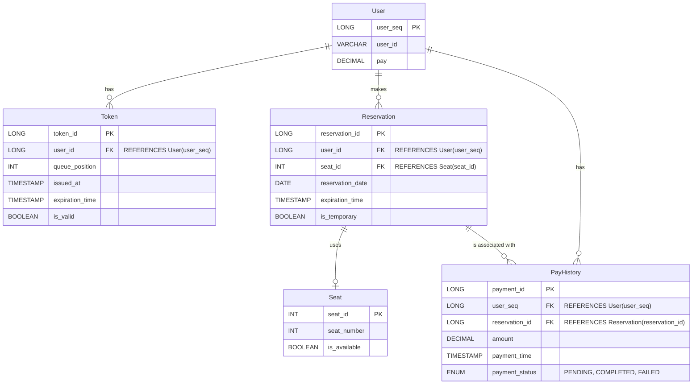

### ERD 설계

### API 명세서
#### 1. 유저 토큰 발급 API
설명: 사용자가 대기열에 들어가기 위해 대기열 토큰을 발급받는 API 입니다.
URL: @PostMapping("/api/tokens")
요청
```markdown
{
    user_id = "test1234"
}
```
응답 성공 시
```markdown
{
    token_id = 67890`
    queue_position = 5
    issued_at = "2024-10-08 10:08"
    expiration_time = "2024-10-08 12:08"
}
```
오류
- 400 Bad Request: 요청이 잘못된 경우
- 500 Internal Server Error: 서버 내부 오류 발생 시

#### 2. 예약 가능 날짜 조회 API
설명: 예약 가능한 날짜 목록을 조회하는 API 입니다.
URL: @GetMapping("/api/reservationData/available")
응답 성공 시
```markdown
{
    available_dates = ["2024-10-13", "2024-10-14", "2024-10-15"]
}
```
오류
- 500 Internal Server Error: 서버 내부 오류 발생 시

#### 3. 예약 가능 좌석 조회 API
설명: 특정 날짜에 예약 가능한 좌석 목록을 조회하는 API 입니다.
URL: @GetMapping("/api/reservationSeat/available")
요청
```markdown
{
    reservation_date = "2024-10-13"
}
```
응답 성공 시
```markdown
{
    available_seats = [1, 2, 3, 4, 5]
}
```
오류
- 400 Bad Request: 요청이 잘못된 경우
- 500 Internal Server Error: 서버 내부 오류 발생 시

#### 4. 좌석 예약 요청 API
설명: 사용자가 좌석을 예약하고 임시로 좌석을 보유하는 API 입니다.
URL: @PostMapping("/api/reservation")
요청
```markdown
{
    user_id = "test"
    reservation_date = "2024-10-13"
    reservation_seat = 1
}
```
응답 성공시
```markdown
{
    reservation_id = 98765
    expiration_time = "2024-10-10 12:05"
    is_temporary = true
}
```
오류:
 - 400 Bad Request: 잘못된 요청 형식
 - 404 Not Found: 좌석 또는 날짜를 찾을 수 없는 경우
 - 500 Internal Server Error: 서버 내부 오류 발생 시

#### 5. 잔액 조회 API
설명: 사용자가 잔액을 조회하는 API 입니다.
URL: @GetMapping("/api/pay")
응답 성공 시
```markdown
{
    user_id = "test"
    amount = "10000"
}
```
오류
 - 400 Bad Request: 잘못된 요청 형식
 - 500 Internal Server Error: 서버 내부 오류 발생 시

#### 6. 잔액 충전 API
설명: 사용자가 잔액을 충전하는 API 입니다.
URL: @PostMapping("/api/chargePay")
요청
```markdown
{
    user_id = "test"
    amount = 5000
}
```
응답 성공 시
```markdown
{
    user_id = "test"
    pay = 15000
}
```
오류
- 400 Bad Request: 잘못된 요청 형식
- 500 Internal Server Error: 서버 내부 오류 발생 시

#### 7. 결제 API
설명: 사용자가 결제하는 API 입니다.
URL: @PostMapping("/api/payment")
요청
```markdown
{
    user_id = "test"
    reservation_id = 67890
    amount = 10000
}
```
응답 성공 시
```markdown
{
    payment_id = 1234
    reservation_date = "2024-10-13"
    reservation_seat = 1 
    payment_status = "COMPLETED"
}
```
오류
 - 400 Bad Request: 잘못된 요청 형식
 - 402 Payment Required: 잔액 부족으로 결제 불가
 - 500 Internal Server Error: 서버 내부 오류 발생 시