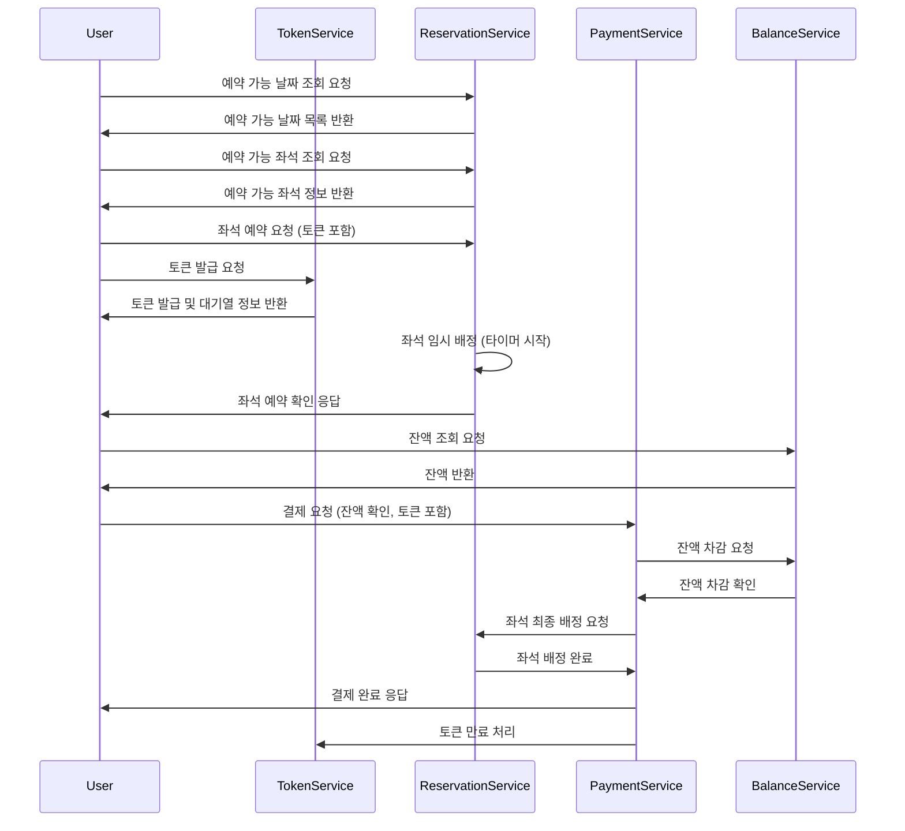
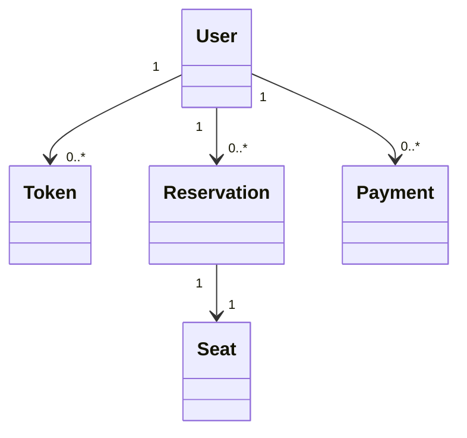

### 시퀀스 다이어그램

```mermaid
sequenceDiagram
    participant User
    participant TokenService
    participant ReservationService
    participant PaymentService
    participant BalanceService

    User ->> ReservationService: 예약 가능 날짜 조회 요청
    ReservationService ->> User: 예약 가능 날짜 목록 반환

    User ->> ReservationService: 예약 가능 좌석 조회 요청
    ReservationService ->> User: 예약 가능 좌석 정보 반환

    User ->> ReservationService: 좌석 예약 요청 (토큰 포함)
    User ->> TokenService: 토큰 발급 요청
    TokenService ->> User: 토큰 발급 및 대기열 정보 반환
    
    ReservationService ->> ReservationService: 좌석 임시 배정 (타이머 시작)
    ReservationService ->> User: 좌석 예약 확인 응답

    User ->> BalanceService: 잔액 조회 요청
    BalanceService ->> User: 잔액 반환

    User ->> PaymentService: 결제 요청 (잔액 확인, 토큰 포함)
    PaymentService ->> BalanceService: 잔액 차감 요청
    BalanceService ->> PaymentService: 잔액 차감 확인
    PaymentService ->> ReservationService: 좌석 최종 배정 요청
    ReservationService ->> PaymentService: 좌석 배정 완료
    PaymentService ->> User: 결제 완료 응답
    PaymentService ->> TokenService: 토큰 만료 처리
```

### 도메인모델링

```mermaid
classDiagram
    class User {
    }
    
    class Token {
    }
    
    class Reservation {
    }
    
    class Payment {
    }
    
    class Seat {
    }

    User "1" --> "0..*" Token
    User "1" --> "0..*" Reservation
    User "1" --> "0..*" Payment
    Reservation "1" --> "1" Seat
```
