### 마일스톤
https://github.com/users/fatallinverno/projects/3

### 전체 시퀀스 다이어그램

### 유저 토큰 API 시퀀스 다이어그램

### 예약 날짜 조회 시퀀스 다이어그램

### 예약 가능 좌석 조회 시퀀스 다이어그램

### 좌석 예약 요청 시퀀스 다이어그램

### 잔액 조회 시퀀스 다이어그램

### 잔액 충전 시퀀스 다이어그램

### 결제 요청 시퀀스 다이어그램

### 클래스 다이어그램

```mermaid
classDiagram
    class User {
        -long userId
        -String name
        -int pay
        +getPay()
        +chargePay(amount: int)
    }
    
    class Token {
        -UUID tokenId
        -long userId
        -DateTime issuedAt
        -int queuePosition
        -DateTime expirationTime
        +isValid(): boolean
        +expireToken()
    }
    
    class Reservation {
        -long reservationId
        -long userId
        -int seatNumber
        -Date reservationDate
        -DateTime expirationTime
        -boolean isTemporary
        +holdSeat(seatNumber: int)
        +releaseSeat()
    }
    
    class PayHistory {
        -long paymentId
        -long userId
        -long reservationId
        -int amount
        -DateTime paymentTime
        +processPayment(amount: int)
        +usageHistory()
    }
    
    class Seat {
        -int seatNumber
        -boolean isAvailable
        +checkAvailability(): boolean
        +reserveSeat()
        +freeSeat()
    }

    User "1" --> "0..*" Token
    User "1" --> "0..*" Reservation
    User "1" --> "0..*" PayHistory
    Reservation "1" --> "1" Seat
```

### 플로우 차트

### 유즈 케이스
